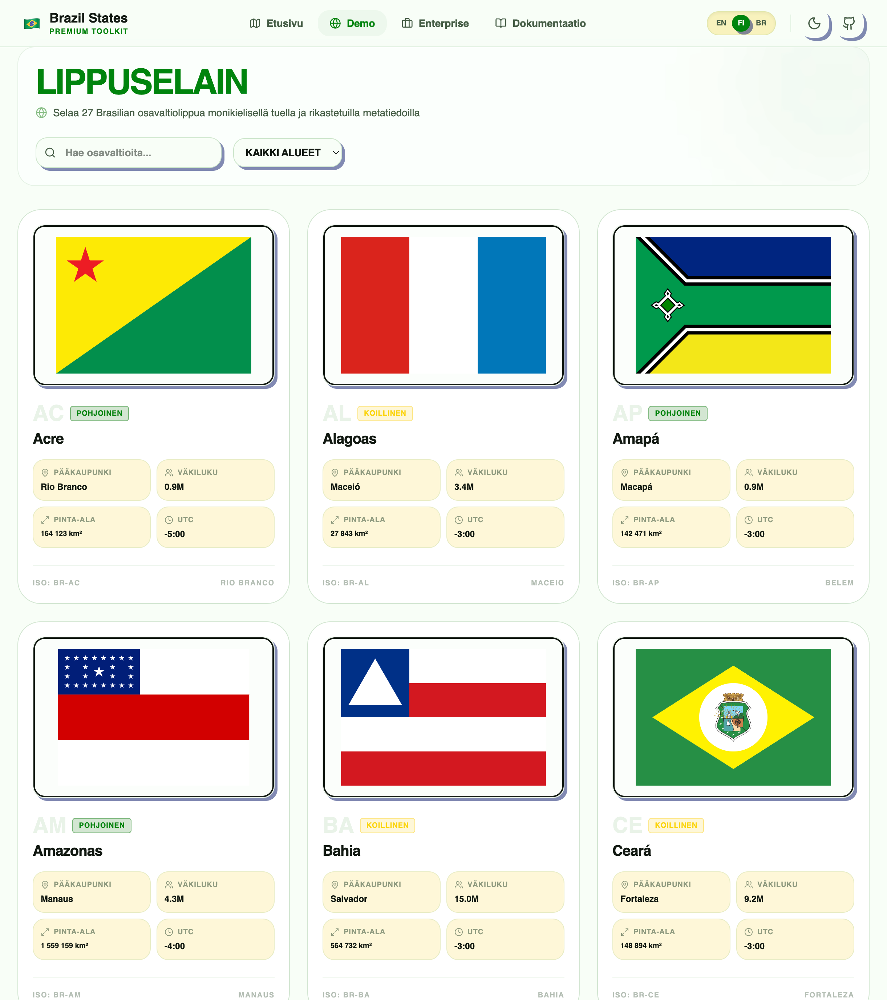

[](https://br-state-flags-demo.arthurreira.dev)

## Mitä rakensin

npm-paketti, joka toimittaa kaikki 27 Brasilian osavaltion lippua erillisinä React SVG -komponentteina — sekä täydennettyä metatietoa (pääkaupunki, väestö, alue) jokaiselle osavaltiolle. Nolla riippuvuutta. Toimii suoraan Next.js:n, Viten ja minkä tahansa TypeScript React -projektin kanssa. SVG:t on optimoitu webille: yhtenäiset kuvasuhteet, minimaaliset tiedostokoot, tarkat viralliset värit.

```bash
npm install br-state-flags
```

```tsx
import { SP, RJ } from 'br-state-flags'
<SP width={120} title="São Paulo" />
```

Demosivu osoitteessa [br-state-flags-demo.arthurreira.dev](https://br-state-flags-demo.arthurreira.dev) toimii kirjaston ensisijaisena dokumentaationa — selattava galleria kaikista 27 lipusta, osavaltion tiedot klikkauksella ja valmiit import-koodinpätkät kopioitavaksi.

## Mitä opin

npm-kirjaston julkaiseminen on eri asia kuin sovelluksen rakentaminen. API-pinnan on oltava vakaa — kun toimitat `import { SP }`:n, sitä ei voi enää nimetä uudelleen. Opin bundle-formaateista (ESM vs CJS), `exports`-kentästä package.json:ssa ja TypeScript-deklaraatioiden kirjoittamisesta niin, että käyttäjät saavat automaattitäydennyksen. SVG-optimointi oli myös uutta: SVGO poistaa metatietoa ja pienentää tiedostokokoja 40–60 % ilman visuaalista muutosta.

## Kohokohdat

- Kaikki 27 Brasilian osavaltion lippua yksittäisinä React SVG -komponentteina
- Ei ajonaikaisia riippuvuuksia
- Täysi TypeScript-tuki prop-inferenssillä
- Osavaltiokohtaiset metatiedot: pääkaupunki, väestö, alue
- Live-demo: [br-state-flags-demo.arthurreira.dev](https://br-state-flags-demo.arthurreira.dev)
- Julkaistu npm:ssä: `npm install br-state-flags`

## Teknologiat

- **Kirjasto:** React, TypeScript, optimoitu SVG
- **Jakelu:** npm (ESM + CJS)
- **Demo:** Next.js, Tailwind CSS
- **Yhteensopivuus:** Next.js, Vite, mikä tahansa React-projekti
