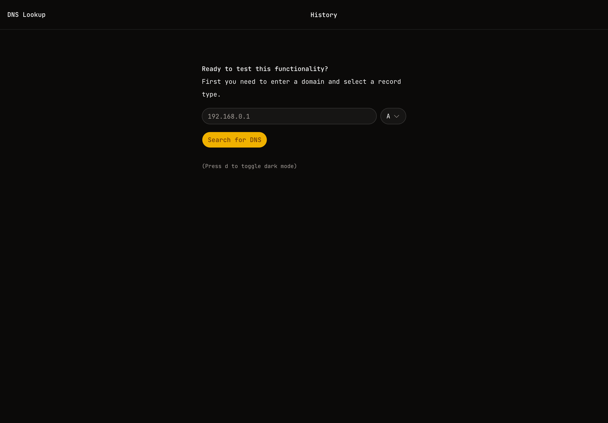
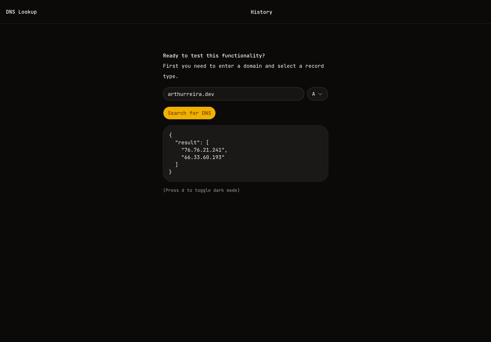
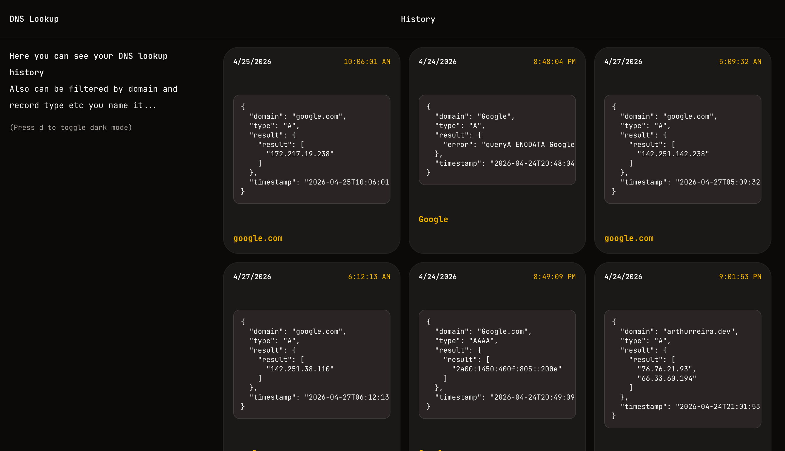

## Overview

This project is a modern web application built to demonstrate how to use **Velite with MDX**.

It supports rich content like:

- Markdown formatting
- Embedded components
- Code blocks

## Features

- Fast performance
- Clean UI
-  Easy customization

## Example Code

````ts
export function greet(name: string) {
  return `Hello, ${name}!`
}
````