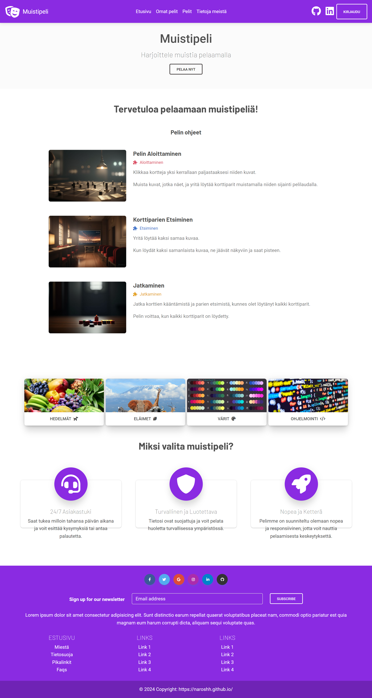

## What I built

A browser-based memory card game built as a school assignment. The player flips cards two at a time looking for matching pairs. A live timer tracks how long each game takes and a move counter records efficiency — both reset on restart. The layout is fully responsive using MDB Bootstrap's grid so it works across phone, tablet, and desktop without media query gymnastics.

The game was hosted on `linuxedu.koulutus.kynet.fi`, the school's Linux server, which meant learning basic server file structure and deployment over SSH rather than just running it locally.

## What I learned

This was one of the first projects where I had to manage game state in vanilla JavaScript without a framework. Tracking which cards were flipped, preventing a third card from being selected before the first pair resolved, and resetting state cleanly between games all required careful thinking about execution order. It taught me that clear state management matters even in small projects — and that deploying to a real server, even a simple one, adds a layer of accountability that running on localhost doesn't.

## Highlights

- Flip-and-match card pairs
- Live timer and move counter
- Win detection with score display
- Responsive MDB Bootstrap grid
- Hosted on the school Linux server

## Tech Stack

- **Frontend:** HTML, CSS, JavaScript (vanilla)
- **UI:** MDB Bootstrap
- **Hosting:** University Linux server (SSH)
