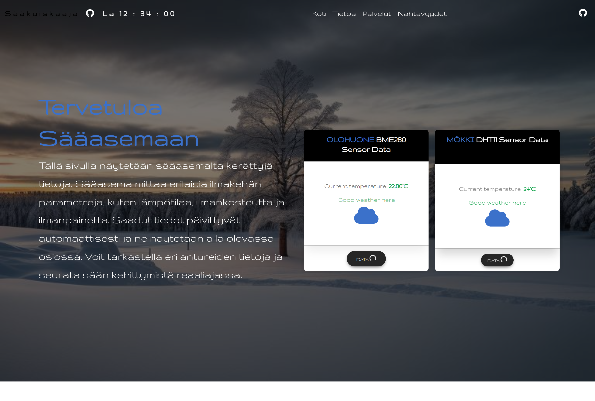

## Mitä rakensin

Kokonainen IoT-putki fyysisestä laitteesta live-koontinäyttöön. ESP32-mikrokontrolleri lukee ympäristödataa jatkuvasti kahdella anturilla: BME280 mittaa lämpötilan, kosteuden ja ilmanpaineen, ja DHT11 toimii toisena vertailulähteenä. Firmware on kirjoitettu Arduino IDE:llä (C++) ja lähettää anturilukemat POST-pyyntönä PHP-päätepisteeseen määrävälein.

Taustapalvelu on paikallisella WampServerillä pyörivä PHP-skripti, joka ottaa pyynnön vastaan, tarkistaa datan ja kirjoittaa sen MySQL-tietokantaan. Koontinäyttö lukee samasta kannasta ja päivittyy automaattisesti 30 sekunnin välein näyttäen tuoreimmat lukemat. Tyylit tulevat MDB Bootstrapista.

## Mitä opin

Tässä projektissa jouduin ensimmäistä kertaa ajattelemaan kolmea täysin erillistä kerrosta yhtä aikaa: laitteistoa eli kytkentöjä, anturiprotokollia ja firmwarea, taustapalvelun dataputkea eli HTTP-pyyntöjä, PHP:tä ja MySQL:ää, sekä käyttöliittymää. Vianetsintä oli vaikeampaa kuin missään puhtaassa ohjelmistoprojektissa, koska vika saattoi olla piirissä, firmwaressa, PHP:ssä tai SQL:ssä.

## Kohokohdat

- ESP32 lukee BME280- ja DHT11-anturit 30 sekunnin välein
- Firmware lähettää JSONin PHP-päätepisteeseen
- PHP tarkistaa datan ja kirjoittaa sen MySQL:ään
- Koontinäyttö päivittyy automaattisesti: lämpötila, kosteus ja paine
- Koko putki laitteistosta taustapalvelun kautta käyttöliittymään

## Teknologiat

- **Laitteisto:** ESP32, BME280 ja DHT11
- **Firmware:** Arduino IDE (C++)
- **Taustapalvelu:** PHP ja MySQL (WampServer)
- **Käyttöliittymä:** JavaScript ja MDB Bootstrap
