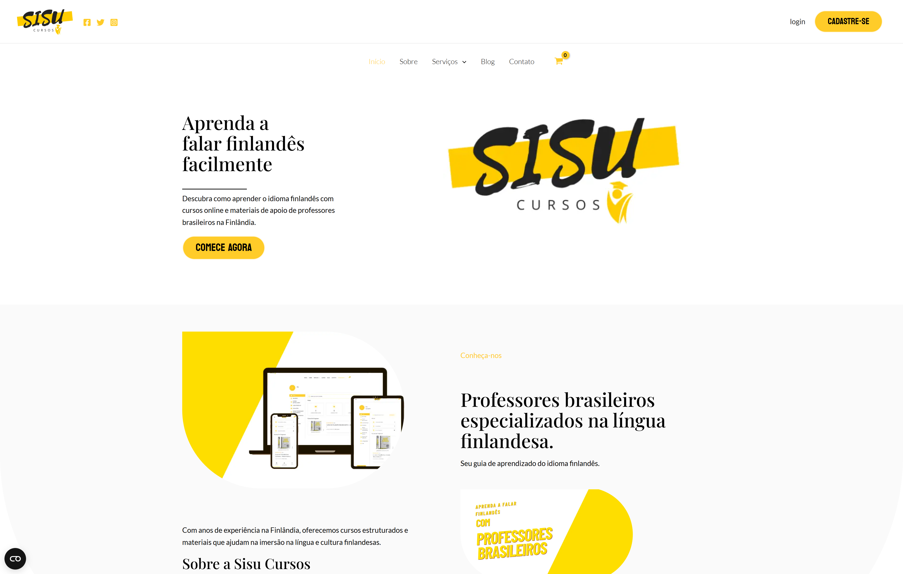

## O que construí

O Sisu Cursos é uma plataforma de ensino de finlandês para brasileiros que vivem na Finlândia — uma comunidade que muitas vezes tem dificuldade para encontrar cursos acessíveis e adequados ao seu contexto cultural. A plataforma usa WordPress, com o TutorLMS cuidando da estrutura dos cursos — aulas, testes e acompanhamento do progresso — e o WooCommerce gerenciando matrículas, pagamentos e entrega dos produtos digitais.

Todo o conteúdo está disponível em português e finlandês. A abordagem bilíngue é intencional: os alunos leem as instruções em português, enquanto as aulas usam finlandês do início ao fim, evitando a dependência constante de tradução que atrasa a aquisição do idioma.

## O que aprendi

Construir um LMS do zero dentro do WordPress revelou a complexidade de combinar ensino online e e-commerce em uma única instalação. Tanto o TutorLMS quanto o WooCommerce fazem suposições próprias sobre o fluxo de checkout; integrá-los de forma consistente exigiu configuração cuidadosa dos plugins e alguns hooks próprios.

## Destaques

- Cursos de finlandês para a comunidade brasileira na Finlândia
- TutorLMS para aulas, testes e acompanhamento do progresso
- WooCommerce para matrículas e pagamentos
- Conteúdo bilíngue: interface em português e aulas em finlandês
- Disponível em [sisucursos.com](https://sisucursos.com)

## Stack tecnológica

- **Plataforma:** WordPress
- **LMS:** TutorLMS
- **E-commerce:** WooCommerce
- **Idiomas:** Português (interface) + finlandês (conteúdo)
