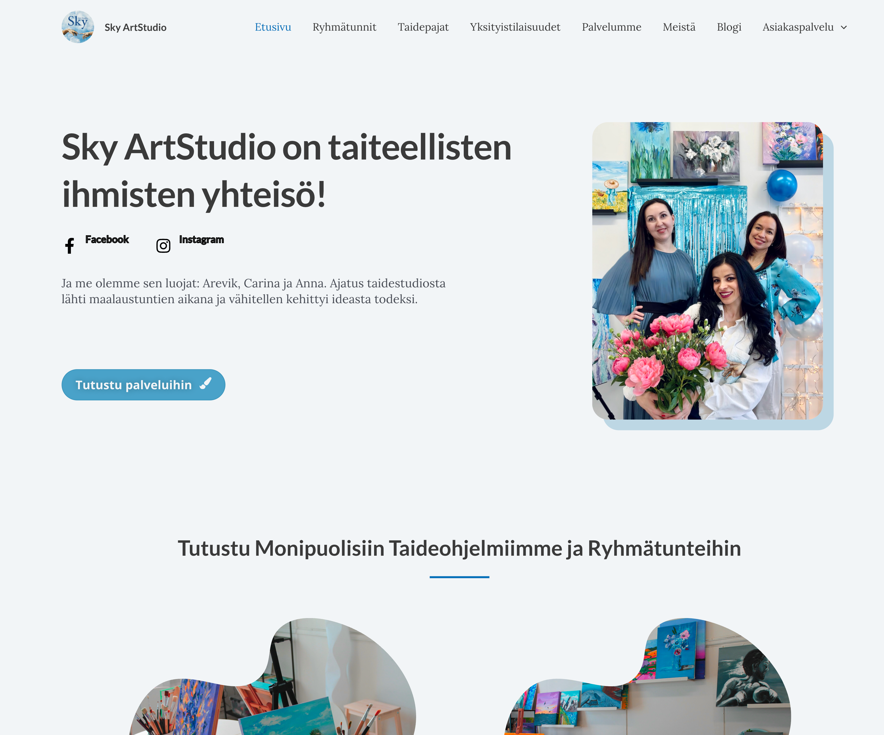

## Mitä rakensin

Ammattimainen verkkosivusto suomalaiselle taidestudioasiakkaalle. Sivusto esittelee teokset galleriassa, kertoo tarjottavista palveluista, kuten tilaustöistä ja työpajoista, ja tarjoaa mahdollisille asiakkaille väylän ottaa yhteyttä. Sivusto on responsiivinen työpöydällä, tabletilla ja mobiilissa. Se on rakennettu WordPressin päälle, ulkoasu on tehty omalla CSS:llä, yhteydenottolomake Contact Form 7:llä ja hakukoneoptimoinnin perusteet Yoast SEO:lla.

## Mitä opin

Asiakastyö tuo mukanaan rajoitteen, jota omissa projekteissa ei ole: jonkun toisen vaatimukset, mieltymykset ja aikataulun. Varsinainen taito oli ymmärtää, mitä asiakas oikeasti tarvitsi sen sijaan, mitä hän pyysi. Nopeasti latautuva galleria merkitsee enemmän kuin demossa vaikuttava. Opin myös, miten suuri osa ammattimaisesta WordPress-sivustosta on asetusten ja lisäosien hallintaa koodin sijaan, ja miksi se on joskus juuri oikea ratkaisu. Asiakas, joka pystyy päivittämään sisältönsä itse ilman kehittäjää, on parempi lopputulos kuin räätälöity sivusto, jota hän ei osaa ylläpitää.

## Kohokohdat

- Teosgalleria kuratoiduilla kokoelmilla
- Palvelusivu tilaustöille ja työpajoille
- Yhteydenottolomake sähköposti-ilmoituksin
- Responsiivinen työpöydällä, tabletilla ja mobiilissa
- Hakukoneoptimoitu, livenä osoitteessa [skyartstudio.fi](https://skyartstudio.fi)

## Teknologiat

- **Alusta:** WordPress
- **Tyylit:** oma CSS
- **Lisäosat:** Contact Form 7 ja Yoast SEO
