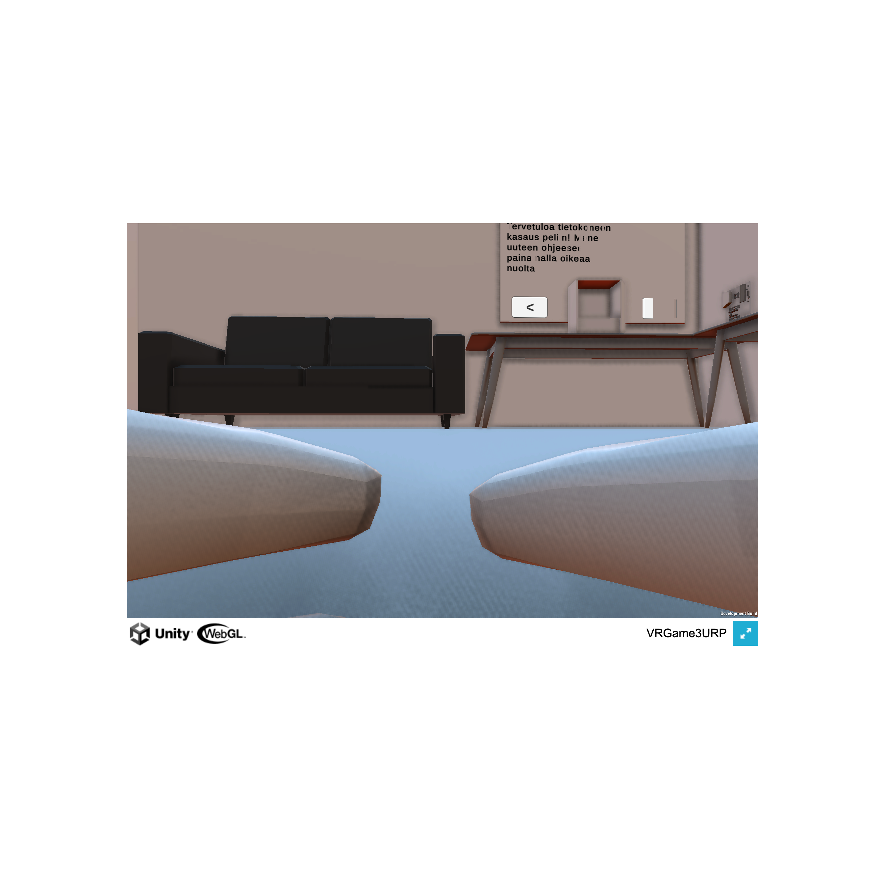

## What I built

PC Builder VR is a school project by a classmate (SakkyTT) where players assemble a full desktop PC in virtual reality. I joined as a contributor focused on two areas: 3D asset creation and performance.

On the asset side, I modeled several PC components in Blender — CPU, RAM sticks, GPU — and exported them into Unity via the URP pipeline. On the performance side, I profiled the Unity scene and identified draw call bottlenecks, resolving them through texture atlasing and static batching. I also made minor UI adjustments to the component selection menu.

## What I learned

Contributing to someone else's codebase is a different skill from building your own. You have to understand decisions you didn't make and work within an architecture you didn't design. The Blender-to-Unity pipeline also taught me that 3D modeling and game engine integration are two separate disciplines that have to be planned together from the start.

## Highlights

- Modeled CPU, RAM, GPU components in Blender → Unity URP
- Profiled and fixed draw-call bottlenecks (atlasing, batching)
- UI adjustments to the component selection menu
- Contributor on a classmate's VR assembly game

## Tech Stack

- **Engine:** Unity (URP)
- **Language:** C#
- **3D:** Blender → Unity FBX
- **Platform:** PC VR
